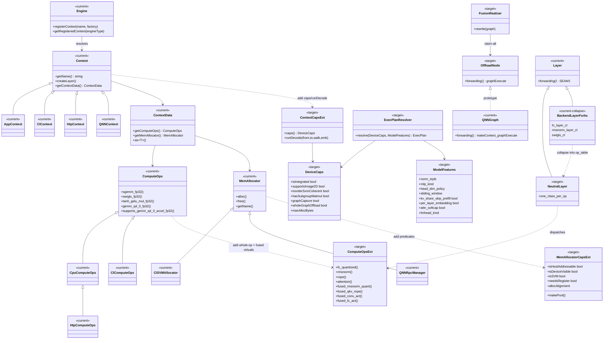
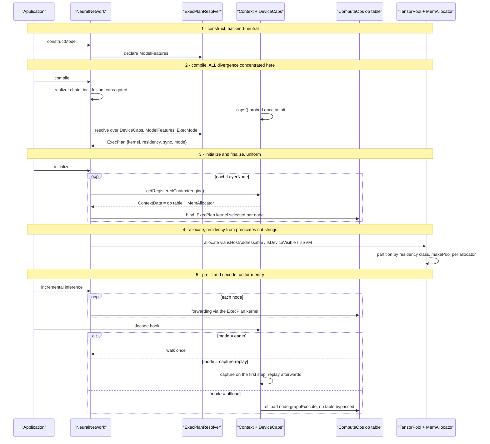

# Multi-backend layer architecture — rules

> **Status: normative.** This document states the rules a change must follow when it adds a
> hardware backend, or adds hardware support for an existing operation. It is a *contract*, not a
> progress report: it deliberately carries no task list, no phase plan and no per-item
> "landed / not landed" tracking, so that it stays citable as it is implemented.
>
> **Scope.** Inference and training dispatch across CPU, OpenCL (Intel Xe, Adreno), and NPU
> (QNN/HTP), plus the shape any further backend has to take.
>
> **Companion document.** [`ARCHITECTURE.md`](ARCHITECTURE.md) in this directory describes the
> dispatch chain that exists today — `Engine → Context → ContextData → ComputeOps → kernels` —
> and the rationale for it. This document extends that chain with the *layer-side* rules
> (§1), the capability/plan layering above it (§2), and the promote/collapse criterion for
> layers (§4). Where the two disagree on a mechanism, `ARCHITECTURE.md` describes the current
> code and this document describes the target; neither overrides the source.
>
> **Anchor policy.** References below are written as `file: symbol`, never `file:line`. Line
> numbers drift silently; a symbol name can be relocated with one `grep`. Please keep new
> references in that form, and do not add a reference to a symbol that is not in the tree —
> every symbol named here was checked against the branch point of the commit that added this
> file.

---

## 1. The add-only invariant has two halves — quote the one you mean

One model definition must run on CPU (including training), OpenCL (Intel Xe, Adreno), and NPU,
and adding hardware must be **add-only**. That sentence is routinely quoted as if it governed any
new accelerator feature, which it does not. Both halves are normative and they cover different
cases.

- **(1a) Backend add-only.** Adding a new hardware backend — a new `Context` / `ComputeOps` /
  `MemAllocator` triad — requires **zero edits** to existing model `.cpp` files, to another
  backend's files, or to the `network_graph.cpp` / `layer_node.cpp` spine. §5 is the worked
  example; the closed-enum edit in §5 step 1 is the single documented exception, and only for
  hardware that needs its own residency plane.

- **(1b) Layer add-only.** Adding hardware support for an **existing** operation on an
  **existing** backend requires **zero new `Layer` subclasses**. It is expressed as a new or
  extended `ComputeOps` whole-op virtual, dispatched from the **same** `Layer` class that already
  runs on CPU. A new `XLayerCl` plus `CudaXLayer` pair registering one type string as two classes
  is a violation of this half — see §4.

Two property vocabularies meet at one matcher, which keeps the combinatorics at **O(N+M), not
O(N×M)**: what the model *is* (`ModelFeatures`) × what the hardware *can do* (`DeviceCaps`) → one
resolved execution plan.

---

## 2. The layered architecture

```
L5  MODEL            single-source neutral graph + ModelFeatures (names NO backend)
L4  RESOLVER         resolve(DeviceCaps x ModelFeatures x ExecMode) -> ExecPlan
L3a OP_TABLE         ComputeOps whole-op virtuals (including fused)
L3b EXEC-ENGINE      SEAM-1 Layer::forwarding (op-node | offload node)
                     SEAM-2 per-backend decode hook
L2  DEVICECAPS       what CAN this hardware do
L1  CONTEXT          link-time self-registration (dlopen for QNN)
L0  HW PROBES        clGetDeviceInfo / vendor device queries
```

**The one rule:** capability flows **up** (L0 → L2), decisions flow **down** (L4 → L3). No layer
calls up. The resolver (L4) is a **pure function** — it must be shadow-runnable and unit-testable
against every hardware baseline before it is allowed to be authoritative.

L0, L1, L3a and SEAM-1 are the chain `ARCHITECTURE.md` already documents. L2, L4 and SEAM-2 are
the additions this document governs.

---

## 3. Target class structure



`<<current>>` marks a type that exists in the tree; `<<target>>` marks one this document
specifies. The stereotype is a structural statement — which side of the seam a type sits on —
not a progress tracker.

**Residency is owned by the allocator, not by the `Context`.** A `Context::residencyFor(role)`
method is deliberately **not** part of the target: the `MemAllocator` capability predicates
(`isHostAddressable` / `isDeviceVisible` / `isSVM` / `needsRegister`) own the decision, and a
per-role crossover (image2d KV versus SVM, for instance) is carried through the allocator's
`makePool()` or a role hint to the allocator. Revisit only if a tensor's role needs model
knowledge the allocator cannot have.

### The `isSVM()` contract

`MemoryData::isSVM()` (`nntrainer/tensor/memory_data.h: MemoryData::isSVM`) means **"this pointer
may be handed to an OpenCL kernel"**. It does **not** mean "unified memory". Every consumer of the
flag is an OpenCL kernel-binding gate — see `nntrainer/tensor/float_tensor.cpp`, where `isSVM()`
guards the accelerated `gemm_q4_0` / `gemv_int4` paths. Consequences, both normative:

1. A non-OpenCL backend whose memory happens to be host-addressable (any unified- or
   managed-memory scheme) **must report `isSVM() == false`**, or a unified build silently routes
   its tensors into OpenCL fast paths.
2. Residency must be **derived from allocator capability predicates, not from the allocator's
   name**. Today `MemoryPool::getMemory` (`nntrainer/tensor/memory_pool.cpp`) stamps the flag with
   `setSVM(allocator_->getName() == "gpu-svm")` — a string comparison that mis-tags every
   allocator that is host-addressable without being an OpenCL SVM allocator. Replacing that
   comparison with a predicate is the first step of the residency work, and no new code may add
   another `getName()` comparison in its place.

---

## 4. Layer promotion, and the collapse rule

`Applications/CausalLM/layers/` carries the LLM layer set. Core `nntrainer/layers/` has
`attention_layer`, `multi_head_attention_layer`, `mol_attention_layer`, `embedding` and
`layer_normalization`, but no RMSNorm, SwiGLU, LLM-MHA or RoPE.

**The criterion.** Promote a layer into the core if its variability is expressible as
**parameters** — that is, as `ModelFeatures` inputs. Keep it application-side if it encodes
single-model or model-tuned behaviour.

| Layer | Verdict | Target |
|---|---|---|
| `rms_norm` | **PROMOTE** | core `rms_norm_layer` |
| `reshaped_rms_norm` | **PROMOTE** | core RMSNorm with a reshape / feature-size parameter (per-head q/k/v norm) |
| `swiglu` | **PROMOTE** | core SwiGLU; CPU `swiglu_fp32` already exists |
| `mha_core` | **PROMOTE** | core LLM MHA (GQA + RoPE + sliding window + softcap) — distinct from the official MHA |
| `qkv_layer` | **PROMOTE** | core fused QKV projection |
| `embedding_layer` | **PROMOTE / MERGE** | reconcile with the official `embedding` (scale parameter) |
| `lm_head` | **PROMOTE** | core lm_head (tied / untied, quantized weight) |
| `logit_softcapping` | **PROMOTE** | core parametrized activation |
| `scalar_multiply` | **PROMOTE** | core elementwise scalar multiply |
| `shared_fully_connected_layer` | **PROMOTE** | core FC with shared-weight binding |
| `tie_word_embedding` | **PROMOTE** | core tied embedding |
| `per_layer_slice` | **KEEP** | model-specific |
| `deberta_attention_layer` | **KEEP** | model-specific |
| `embedding_normalize_layer`, `embedding_pooling_layer` | **KEEP** | application-specific |
| `rms_reverse_norm` | **KEEP** | specialized |
| `causal_conv1d_layer` | **KEEP** | model-specific |
| the mixture-of-experts layers, which live beside their models under `Applications/CausalLM/models/` rather than in `layers/` | **KEEP** for now | each implementation is tuned to its model; promote once parameterized into one general primitive |

**The collapse rule.** Every per-backend fork of a layer — anything under
`nntrainer/layers/cl_layers/` that shadows a neutral layer, and any `*_gpu` variant of an
application layer — **collapses** into one neutral layer that dispatches through a `ComputeOps`
whole-op virtual. `fc_layer_cl`, `rmsnorm_layer_cl` and `swiglu_cl` are the standing instances.
A **KEEP** layer is not exempt from the collapse rule: it stays application-side, but it still
dispatches through the op table rather than carrying its own backend fork.

**Interim rule, enforceable before the virtuals land.** A whole-op virtual does not yet exist for
every operation (`rmsnorm`, `rope` and `attention` are absent from
`nntrainer/tensor/cpu_backend/compute_ops.h`), so a full collapse is blocked for those. Until the
virtual lands, new accelerator work on such an operation must:

- **not** add a per-backend `Layer` subclass beyond the fork that already exists for it, and
- keep the whole-op body in a single whole-`Tensor` helper called **once** from `forwarding()`,

so that migrating to `ops->rmsnorm(...)` later is a mechanical swap rather than a rewrite.
LayerNorm and GELU each need their own virtual (`layer_norm`, `gelu`); they are not
parameterizations of `rmsnorm` — LayerNorm adds `beta` and a mean-subtraction pass. One virtual
per named kernel is the house style already set by `swiglu_fp32` and `tanh_gelu_mul_fp32`.

---

## 5. Adding a new hardware backend — the procedure

The goal is to light up new hardware without touching any CPU/OpenCL hot path or any model
`.cpp`. The HTP backend (`nntrainer/htp_context.h: HtpContext`,
`nntrainer/tensor/htp_backend/htp_compute_ops.cpp: HtpComputeOps`) is the one in-tree instance of
this procedure and is cited below wherever it exercised a step.

1. **Decide whether you need your own residency plane.** If you do, the closed enum must be
   extended, and this is the single unavoidable shared edit:
   - `api/ccapi/include/common.h: LayerComputeEngine` — currently `{CPU, GPU, QNN, HTP}`.
   - `nntrainer/utils/base_properties.h: ComputeEngineTypeInfo::EnumStr` — currently
     `{"cpu", "gpu", "qnn", "htp"}`.

   Both `Engine::parseComputeEngine` (`nntrainer/engine.cpp`) and the layer-level
   `getComputeEngine` (`nntrainer/layers/layer_node.cpp`) resolve `engine=` by looping that
   enum/string pair, so a backend that declares its own plane is visible only after both are
   extended. **Opening this lookup to the live registered-context name set is the change that
   retires the exception** — after it, a new backend touches neither file. A backend that reuses
   an existing plane needs no edit here.

2. **Add the `Context` [new files].** Subclass `Context`; return your name from `getName()`;
   self-register at link time (the OpenCL pattern) or via `dlopen` (the QNN pattern, for a closed
   vendor SDK). Add the `caps()` override returning your `DeviceCaps`.
   *`HtpContext` is the worked instance of the registration half; it does not override `caps()`,
   so that half has no in-tree precedent yet.*

3. **Choose an offload mode.**
   - **Whole-graph offload.** The graph is claimed into a single node whose `forwarding()` runs a
     vendor-compiled binary; the op table is bypassed entirely. `QNNGraph`
     (`nntrainer/qnn/jni/QNNGraph.cpp`) is the existing instance, specific to QNN; generalizing it
     into a reusable `OffloadNode` is target work.
   - **Op-by-op.** Subclass `ComputeOps` — or `CpuComputeOps`, so unported operations fall back to
     a working host path — and implement the operations your kernel library covers, each gated by
     its `supports_*()` predicate. `HtpComputeOps : CpuComputeOps` overriding the quantized GEMM
     entry points is exactly this shape, and is the proven path.

4. **Add the `MemAllocator` [new files].** Subclass `MemAllocator` and implement the capability
   predicates (`needsRegister` for ION/RPC-style memory, `isHostAddressable`, `allocAlignment`,
   `makePool()`). Add a new residency tag only if a genuinely new memory kind is needed.
   *The HTP backend added the allocator but not the predicates; the predicate half has no in-tree
   precedent yet.*

5. **Override the decode hook, only if it buys something.** The default is to walk the graph; a
   backend with a record/replay or graph-capture queue overrides it. The HTP backend took the
   default and works.

6. **Touch nothing in the resolver.** `ModelFeatures` is orthogonal to hardware; a new backend
   inherits the same plan inputs.

**What NOT to touch:** any `Applications/CausalLM/models/*.cpp`, another backend's `ComputeOps`,
another backend's kernels, the `network_graph.cpp` finalize/allocate spine, the memory planners
(integer-only by design), or the neutral `tensor_pool` path.

**Summary: new hardware = new `Context` + new `MemAllocator` + (offload node OR new `ComputeOps`),
and — only if it declares its own residency plane — one enum value and one string.**

---

## 6. Per-hardware execution, and where the backends diverge

The same compiled neutral graph runs one decode step on every backend. After finalize, each node
is bound to its `ContextData`'s `ComputeOps` and `MemAllocator`. The divergence to watch:

| Stage | CPU | OpenCL (Intel / Adreno) | NPU (whole-graph offload) |
|---|---|---|---|
| **compile** | per-op graph | per-op graph | **claim-all → one offload node** (the only stage that changes node count) |
| **engine / pool** | host pool, default `MemAllocator` | SVM allocator | RPC-memory pool, registration required |
| **finalize** | `CpuComputeOps` | `ClComputeOps`; backend layer forks collapse into the op table | op table **bypassed** — the offload node binds a vendor binary |
| **allocate** | host residency | SVM plus device buffers; image2d KV is Adreno-only, since the image read builtins do not compile on Intel NEO | RPC memory, needs registration |
| **decode** | eager walk, no hook | eager walk; coherence drain where the device has coarse-grain SVM only | one `graphExecute` over the whole graph |

Two rules follow from the table and are normative:

- **A backend-specific decode strategy belongs behind one `Context` hook**, not in the model or
  the graph walker. Whether that hook captures, replays, or simply walks is a decision the
  resolver makes from `DeviceCaps` and the execution mode — one hook, per-backend implementation.
- **Whole-graph offload is a compile-stage rewrite**, not a runtime branch. It is expressed as a
  fusion pass that claims nodes; nothing downstream needs to know the graph was rewritten.

### The target shape

After the refactor, backend divergence is concentrated at **compile time** — `ModelFeatures ×
DeviceCaps → ExecPlan` decides kernel, residency, synchronization and mode *once* — and execution
is uniform: one neutral graph parametrized by that plan, with no per-backend layer forks and no
scattered environment-variable branches at the call sites.



---

## 7. Per-model construction, and what `ModelFeatures` has to carry

Every model derives `Transformer → {Model}Transformer → {Model}CausalLM`
(`Applications/CausalLM/models/transformer.h`) and builds its graph declaratively through
`createLayer(type, props)`, with no eager forward at build time. The graph is single-source: the
engine is resolved once from the process-wide `nntrainer::Engine::Global()` registry
(`Applications/CausalLM/models/causal_lm.cpp: CausalLM::registerCustomLayers` is the call site
that reads it) and stamped on the layers, so the **same graph** finalizes onto whichever backend
is registered.

Per-model divergence lives entirely in the `createAttention` / `createMlp` /
`createTransformerDecoderBlock` / `constructModel` overrides declared virtual in
`transformer.h` — `qwen3_causallm.h` overrides one of them, `gemma4_causallm.h` overrides four.
**That set of overrides is exactly the data `ModelFeatures` has to encode**, so that the resolver
reads a declared feature rather than inferring the model from its name. A per-model `if` on a
model identity — anywhere below the model class — is the anti-pattern this replaces.

The axes, from the models in the tree:

| Axis | What varies |
|---|---|
| `has_qk_norm` / `has_v_norm` | per-head q/k (and sometimes v) normalization, present or absent |
| `head_dim_policy` | one head dimension for all layers, or distinct dimensions for sliding and global layers |
| `mlp_kind` | SwiGLU (SiLU gate) or GeGLU (tanh-approximated GELU gate) |
| `norm_style` | pre-norm, or sandwich norm (a second normalization after the residual branch) |
| `sliding_window` | absent, uniform, dual, or alternating by layer index |
| `kv_share_skip_prefill` | last N layers reuse an earlier layer's KV and skip prefill |
| `per_layer_embedding` | a per-layer embedding stream merged into each block |
| `attn_softcap` / `final_softcap` | logit soft-capping inside attention, and/or on the final logits |
| `lmhead_kind` | tied to the embedding, or an untied and separately quantized weight |
| `decode_accel` | whether the decode-step attention and RoPE are worth putting on the accelerator |

The resolver consumes these together with `DeviceCaps`. Neither vocabulary may name a backend,
and neither may name a model.

---

## 8. Fusion

Fusion is the one optimization that crosses back to the CPU: it is a memory-hierarchy *locality*
win — CPU cache, GPU registers and local memory, NPU tightly-coupled memory. Residency,
capture-replay and whole-graph offload are accelerator-only; fusion is not.

**Three-way split, and each part has one owner:**

- *transformation* — a backend-neutral realizer, a sibling of
  `nntrainer/compiler/bn_realizer.h` and `nntrainer/compiler/activation_realizer.h`, both already
  in the realizer chain (`nntrainer/models/neuralnet.cpp: NeuralNetwork::compile`);
- *profitability* — caps-gated: fuse only where it avoids a slow-memory round trip;
- *kernel* — a fused `ComputeOps` virtual, gated by its own `supports_fused_*()` predicate, with
  the unfused path as the fallback.

| Category | Examples | Applies to | Existing seam |
|---|---|---|---|
| **Activation / epilogue** | `conv+act`, `conv+bn+act`, `fc+act`, `matmul+bias+act` | CNN **and** LLM, training **and** inference, all backends — the broadest reach | `ActivationRealizer`, `BnRealizer` |
| Gated MLP | gate-and-multiply MLPs, optionally folding the output quantization | LLM | `swiglu_fp32`, `tanh_gelu_mul_fp32` |
| Norm | normalization folded with the residual add | LLM, CNN | — |
| Projection | QKV projection folded with RoPE | LLM | — |
| *(kernel-internal, not a realizer target)* | dequantize-and-matmul | all | lives inside the GEMM kernel |

**Activation fusion has two forms and they are not equally valuable.** *In-place activation*
(operating on the convolution's output buffer) only saves a buffer. **Epilogue fusion** computes
the activation *inside* the GEMM or convolution kernel before the write, so the pre-activation
tensor is never materialized — that is the real win. Prefer the epilogue form, expressed either as
a fused virtual or as an activation-epilogue parameter on the existing kernel.

Two cautions, both learned the expensive way:

- A fused backward pass is **not** the fused forward pass read backwards; folding an activation
  into a GEMM drops the activation derivative the backward pass needs. Fusion that changes the
  gradient must be gated to inference until the backward path is written to match.
- Fusion is a graph rewrite, so it must be **token-identical gated**: the fused and unfused graphs
  must produce identical output on every backend before the unfused path is removed.

---

## 9. Design decisions

These are settled. Each is a decision this document is the record of; reopen one by proposing a
replacement, not by writing code that assumes the other branch.

1. **Promotion criterion.** Promote a layer to the core if the variability is expressible as
   parameters or `ModelFeatures`; keep it application-side if it is single-model or model-tuned.
   This same line is the library/application boundary. See §4 for the classification.

2. **Thin `Layer` plus whole-op op table.** The `Layer` owns structure, shape, weight binding and
   orchestration; `ComputeOps` owns the whole-op kernel — one call per operation, never one call
   per element. A layer that orchestrates several operations makes several op-table calls. This
   matches the existing `swiglu_fp32` / `tanh_gelu_mul_fp32` shape.

3. **Whole-graph offload is the default NPU mode.** It works today, gives the best performance,
   and needs the least new machinery. Op-by-op NPU dispatch is the second mode, sharing the same
   claim decision — the HTP backend is that mode's in-tree instance.

4. **The `MemAllocator` owns residency.** Capability predicates on the allocator decide the
   residency class; no `Context::residencyFor` method. See §3.

5. **One decode hook on `Context`, per-backend and caps-driven.** Each backend implements it for
   its best path. A within-backend difference — an integrated part wanting a different strategy
   from a discrete one — is a `DeviceCaps` decision *inside* that backend's hook, not a second
   `Context`.

6. **Fusion is part of the refactor, not a follow-on.** A fusion realizer in the compile chain,
   caps-gated; activation/epilogue fusion first, because it is the most general and benefits the
   CPU, CNN and training paths too. The CPU gets fusion by default.

7. **Open the engine lookup to registered names.** `engine=` should validate against the live
   registered-context name set rather than the closed enum plus string list. This is the shared
   foundation for vendor add-only backends and for a public layer-registration facade.

---

## 10. Known gaps this document is written against

Stated so that a reader is not surprised, and so a reviewer can check a change against them. These
are gaps in the code relative to the rules above; they are not a schedule.

- **No whole-op virtual for `rmsnorm`, `rope` or `attention`.** They are absent from
  `nntrainer/tensor/cpu_backend/compute_ops.h`, so §4's collapse is blocked for those operations
  and §4's interim rule applies instead.
- **Residency is decided by an allocator-name string comparison** in
  `nntrainer/tensor/memory_pool.cpp` — see §3.
- **`engine=` resolves against a closed enum** in `nntrainer/engine.cpp` and
  `nntrainer/layers/layer_node.cpp` — see §5 step 1 and decision 7.
- **There is no public layer-author API.** `ml::train::Layer`
  (`api/ccapi/include/layer.h`) is a consumer facade: it exposes weights and properties but not
  `finalize` / `forwarding` / `calcDerivative` / `exportTo`. Every application layer therefore
  inherits the internal base, and registration goes through a concrete-context downcast —
  `static_cast<nntrainer::AppContext *>(engine.getRegisteredContext("cpu"))->registerFactory(...)`
  in `Applications/CausalLM/models/causal_lm.cpp: CausalLM::registerCustomLayers`, because
  `registerFactory` is declared on `AppContext` (`nntrainer/app_context.h`) and not on the
  `Context` base. **A public registration facade — a `Context` base virtual plus a free function
  that hides both the `Engine` singleton and the concrete context type — is the fix, and no new
  code should add another downcast.**
- **No device-capability struct and no plan resolver.** Until they exist, per-hardware behaviour
  is selected by environment variables; see [`../ENV_FLAGS.md`](../ENV_FLAGS.md). Each such
  variable is a resolver cell that has not been written yet, and the direction of travel is from
  the variable to a derived capability, never the reverse.
