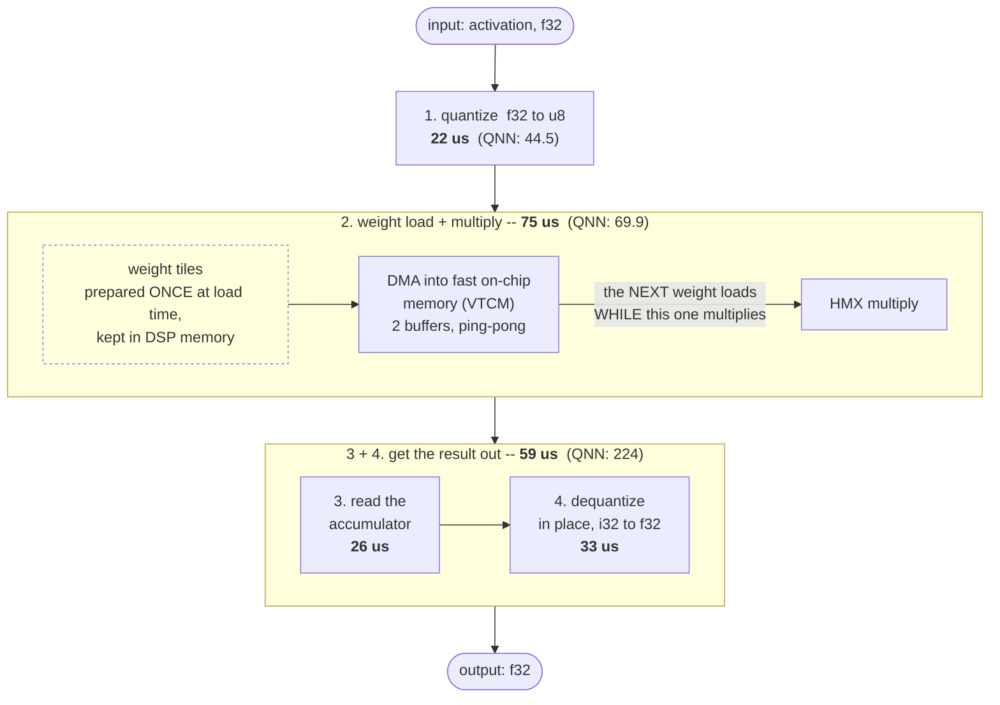
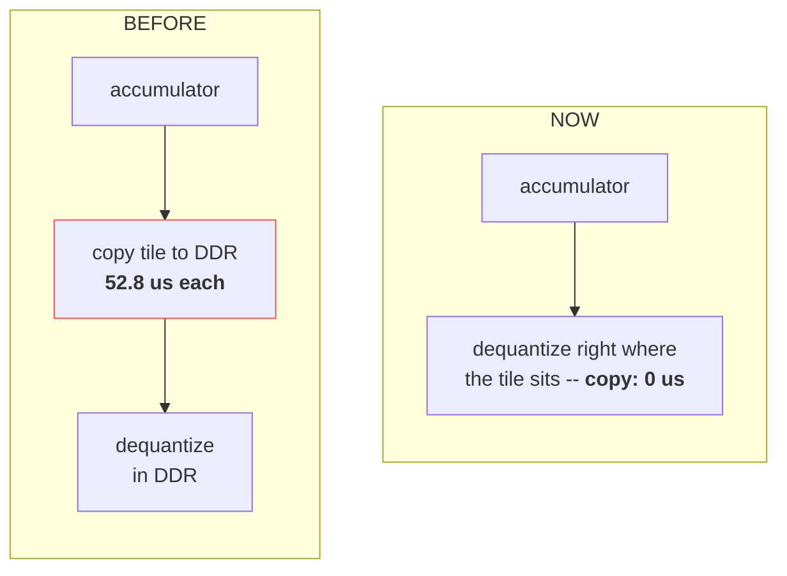

<!-- SPDX-License-Identifier: Apache-2.0 -->

# 34 -- FC layer: the measured tables, the flow, and what each optimization did

Device run 2026-08-08, Galaxy S25 Ultra, q_proj (K 1024, N 2048, Qwen3-0.6B),
poll-mode QoS + ION buffers active, all 24 timed==production bitwise gates
PASS. Every number here is reproducible with:

    bash test/htp/run_u8i4_layer_on_device.sh
    tools/htp_fc_report.py --qnn-profile --qnn-m 64

Doc 33 recorded the comparison method and three predictions before this run;
§5 settles them (one was wrong, usefully).

## 1. The headline tables

**Wall** (one FastRPC call end to end, f32 in / f32 out, avg of 10), us:

| M | i4 x1 | i4 x3/mm | i4 x6/mm | i8 x1 | i8 x3/mm | i8 x6/mm |
|---|---|---|---|---|---|---|
| 1 (decode) | 325 | 139 | **98** | 390 | 171 | 123 |
| 64 | 516 | 270 | 200 | 539 | 295 | 213 |
| 512 | 1,863 | 1,166 | 954 | 1,935 | 1,220 | 1,011 |
| 1024 | 3,101 | 2,012 | **1,817** | 3,071 | 2,042 | 1,885 |

xN = N matmuls in ONE call (a q/k/v or gate/up set), divided by N. That is
the number a real model sees, since no model runs one lone projection.

**DSP only** (no FastRPC -- the term comparable to a QNN per-op number), us:

| M | i4 x1 | i8 x1 | i4 x6/mm | i8 x6/mm |
|---|---|---|---|---|
| 1 | 113 | 152 | 73 | 83 |
| 64 | 156 | 201 | 133 | 150 |
| 512 | 1,113 | 1,180 | 842 | 874 |
| 1024 | 2,229 | 2,308 | 1,662 | 1,758 |

For the org's FC comparison table (ms, u8i8, same convention as the attention
row): **seq 512 = 1.935 wall / 1.180 dsp; seq 1024 = 3.071 wall / 2.308 dsp**
(isolated; x6-amortised 1.011/1.885 wall). The QNN cells still need a QNN FC
net-run at those sequence lengths -- the 513 us profile below is one op at M=1.

## 2. Against QNN, stage by stage

QNN u8i4, one FC op, S26 Ultra, M=1 (their table does not state M; both the
implied MAC rate and the 15 GB/s weight-read rate pin it to 1 -- doc 33 §4).
Our columns are M=64: the accumulator is 64 rows wide either way, so the
multiply, weight DMA and accumulator read are the same work at M=1 and M=64;
only our quant/dequant cover 64 real rows against their 1.

| QNN stage | us | HexKL stage | u8i4 | u8i8 |
|---|---|---|---|---|
| input slice / load (uint8) | 44.5 | quant (f32 -> u8 AH) | 22 | 25 |
| **FC (weight load + compute)** | **69.9** | **micro-mm + weight DMA** | **75** | **114** |
| output format / layout (uint8) | 151.1 | acc_read + dequant | 59 | 56 |
| output writeback | 72.9 | acc_copy | 0 | 0 |
| accelerate execute (device) | 347.0 | dsp_total | 156 | 201 |
| NetRun - accelerate | 166.0 | transport (FastRPC) | 326 | 330 |
| NetRun (steady state) | 513.0 | wall | 516 | 539 |
| one-time init | 5,097 | init (weight bake) | 12,213 | 11,157 |

The verdicts, in the order they matter:

- **Compute only** (the like-for-like i4 column): isolated **75 vs 69.9 us --
  parity, 1.07x QNN**. Amortised in a group, **55 us -- 1.3x FASTER than
  QNN**, because the cross-matmul prefetch hides the weight DMA that an
  isolated call must eat synchronously.
- **Whole device timeline: 156 vs 347 us, 2.2x faster** -- while carrying 64
  rows of quant/dequant against their 1. Their 151 us output-format stage is
  what our in-place dequant (59 us, at 64x the rows) replaced.
- **acc_read is width-independent in the measurement** (18-26 us at both i4
  and i8), as it must be -- the accumulator drain cannot see the weight
  width. The i4/i8 columns differ by the weight DMA and nothing else, which
  is the prediction the two-width table existed to check.
- **Wall is a tie (516 vs 513)** but not a like-for-like one: ours moves f32
  over FastRPC (4x their bytes) and 64x their rows; theirs pays a heavier
  host stack. Quote dsp, not wall, when the question is the kernel.
- **Init: ours is 2.2-2.4x theirs.** Real, and the right trade so far -- it
  is paid once per weight per process lifetime, and it is what makes every
  later call start from resident WH bytes. Untouched by any optimization
  pass to date.

## 3. The flow as built, at the comparison point (i4, M=64, x1)

M=64 is the baseline every QNN number is read against (§2), so the flow is
annotated at that shape, with QNN's corresponding stage beside each of ours.

Total on the DSP: **156 us, vs QNN 347 us** -- and the whole gap is in the
"get the result out" half, not in the multiply.

Two mechanisms carry that result. First, the **DMA pipelining** inside step
2: with 2 VTCM buffers, weight i+1 streams in while weight i is multiplying,
so in a call that carries several matmuls only the FIRST load is ever waited
on:

```mermaid
gantt
  title one call, 3 matmuls -- only load 1 costs time
  dateFormat X
  axisFormat %s
  section weight DMA
  load w1 (exposed, 35 us) : 0, 35
  load w2 (hidden)         : 35, 70
  load w3 (hidden)         : 75, 110
  section HMX multiply
  multiply w1              : 35, 75
  multiply w2              : 75, 115
  multiply w3              : 115, 155
```

Measured: one matmul alone pays 75 us; three in one call pay **55 us each**
(the DMA wait per matmul falls 35 -> 12.3 us). That 55 is the number that
beats QNN's 69.9.

Second, the **deleted copy** in the "get the result out" half:

The middle step is simply gone: the tile is dequantized where the hardware
put it, and the f32 result goes straight to the output. (QNN still pays a
copy -- its "output writeback" is 72.9 us.)

The full detail (DMA double-buffering, VTCM, FastRPC costs), in plain
ASCII for terminals and for contexts where mermaid does not render:

    ARM                            CDSP                    us    %   QNN us
    ---                            ----                    ---------------
    act f32 256 KB --FastRPC--> [1] quant: per-row minmax   22  14%   44.5
                                    scan, f32->u8, pack to       (input
                                    AH in VTCM (HVX pool)         load)
                                        |
    weight: DSP-heap resident,          v
    WH-baked ONCE at register ---> [2] DMA ring: WH tiles   35  22%   \
    (init 12.2 ms, not per call)       DDR->VTCM, double-        [2]+[3]
                                       buffered (wait only)       = 75
                                        |                             |
                                        v                            69.9
                                [3] HMX micro-mms 64x32x32  40  26%  (FC =
                                    2,048 mms, ~0.02 us each      weight+
                                        |                         compute)
                                        v
                                [4] acc_read: accumulator   26  17%   \
                                    -> VTCM tile (vendor)        [4]+[5]
                                        |                         = 59
                                        v                             |
                                [5] dequant IN PLACE on     33  21%  151.1
                                    the VTCM tile, i32->f32       (output
                                    straight to DDR out           format)
                                        |
    out f32 512 KB <--FastRPC---------- +      [dsp_total   156      347 ]
                                               [transport   326      166 ]
                                               [wall        516      513 ]

The stage this flow no longer has -- deleted by the in-place dequant
(80db05e), and the reason acc_copy is 0 in every breakdown while QNN's
"output writeback" costs 72.9 us:

    [4] acc tile --copy_32b_to_submatrix--> DDR staging --dequant--> DDR out
        52.8 us per readout when it existed. The breakdown line "in-place
        tile dequant ACTIVE (row stride 32)" is the runtime ramp-probe
        confirming the layout that makes skipping it safe.

At prefill the same flow shifts weight: M=1024 is quant 633 + drain 39 +
mm 619 + acc_read 380 + dequant 558 = 2,229 us, i.e. quant+dequant grow to
53% -- that shift is what makes §5's u8-endpoint conclusion, not this shape.

## 4. What each optimization did, evidence at M=64 unless marked

Ordered by impact. C attacks the weight DMA INSIDE the DSP; E attacks the
FastRPC round trip on the host side -- both "batch several matmuls", but
they delete different costs, so they are different rows.

| # | optimization | flow stage | effect (measured) |
|---|---|---|---|
| A | in-place tile dequant, layout ramp-probed at runtime | [4]->[5] | acc_copy = 0 (QNN's writeback: 72.9); our [4]+[5] = 59 vs QNN's output stage 151.1, at 64x the rows |
| B | weight residency + one-time WH bake | [2] | zero bake in any per-call number; paid once at init (12.2 ms) |
| C | cross-matmul DMA prefetch (ring, double buffer) | [2] | compute 75 -> 55 us/mm (x1 -> x3); drain 35 -> 12.3 us/mm |
| D | vectorized quant + HVX worker pool | [1] | 22 us for 64 rows vs QNN's 44.5 for its 1-row input stage |
| E | group calls: one FastRPC for a q/k/v set | RPC | transport 326 -> 68 us/mm, wall 516 -> 200 us/mm (x6) |
| F | poll-QoS + ION payload buffers | RPC | keeps the pipe the bound: 44.6 GB/s sustained at the 52 MB x6 M=1024 payload |
| G | session-scoped hw_init + HMX lock + VTCM | -- | absent from every per-call number |

What was measured and REJECTED stays in 32 §5 (s_band VTCM, pooled tile
dequant, constant P params) -- nothing here re-opens those.

## 5. Doc 33's predictions, settled by this run

1. **"M=1 pays ~778 us of issue for the 64-row padding" -- WRONG, 20x.**
   Measured micro-mm + loop is 32-45 us at M=1 and ~619 us at M=1024:
   **~0.019 us per micro-mm**, not the 0.38 the attention-derived cost model
   says. The two-parameter fit's c_mm was carrying attention's per-tile loop
   overhead, not the multiply; FC is the cleaner measurement and the model
   needs recalibration before it is used to justify anything again. The
   padding tax at M=1 is real but ~40 us, and the decode gap is transport --
   so the GEMV-instead-of-HMX idea (32 §3 item 1c) is NOT worth building for
   FC. The x6 group already gets decode to 98 us/mm wall.
2. **"Prefill becomes issue-bound" -- no: it is quant/dequant-bound.** At
   M=1024, quant+dequant = 1,191 of 2,229 us (53%); the multiply is 28%.
3. **"If quant+dequant approaches QNN's 56%, build the u8 endpoint" -- the
   condition fired: 53%.** A u8-in/u8-out layer entry (per-row scale/zp from
   the caller -- `hexkl_mm_opts` already takes them) removes most of that 53%
   AND cuts the FastRPC payload 4x, attacking both of prefill's remaining
   buckets at once. This is the next FC lever, ahead of anything in the
   kernel.
