<!-- SPDX-License-Identifier: Apache-2.0 -->

# 37 -- T2 설계: HMX와 HVX가 둘 다 돌게 attention을 pipelining하기

doc 36의 T2 설계 문서입니다. doc 36은 T2에 한 문단과 "~1.85x"라는 숫자만
줬는데, 이 문서는 **그 숫자가 무엇에 대한 숫자인지**, 후보 메커니즘이 왜 둘인지,
그중 **하나만 먼저 만들어야 하는 이유**, 그리고 측정이 가능해지려면 무엇이 먼저
참이어야 하는지를 씁니다.

아직 구현 안 됨. 선행 조건: **T1 (integer requantize)이 먼저 랜딩해야 합니다** --
doc 35 §3, 그리고 attention에 한정한 재유도는 아래 §1.

## 1. "1.85x"가 가리키는 범위, 그리고 attention만 놓고 보면 얼마인가

이 숫자는 **block scope**이지 SDPA scope이 아닙니다. 그리고 둘의 차이가 계획을
바꿀 만큼 큽니다.

오버랩이 지울 수 있는 최대치는 `min(HVX_total, HMX_total)`입니다 -- 한쪽 lane을
다른 lane이 가진 공간보다 더 많이 숨길 수는 없습니다. 따라서:

| 범위 | | HVX | HMX | 합계 | 천장 |
|---|---|---|---|---|---|
| SDPA (kv=1024 prefill) | 현재 | 5,206 | 1,614 | 6,820 | 1.31x |
| SDPA | T1 이후 | 2,740 | 1,614 | 4,354 | **1.59x** |
| block 전체 | T1 이후 | 3,731 | 4,396 | 8,127 | **1.85x** |

신뢰도가 보이도록 유도 사슬을 밝힙니다. SDPA의 lane 분할은 **실측**입니다
(doc 32 §5: dequant 2,357, quant 1,166, softmax 806, gather 877, dsp_total
6,820). "T1 이후"는 integer requantize가 quant+dequant의 ~30%를 남긴다는
**가정**이지 측정이 아닙니다. block 행은 여기에 q/k/v와 o_proj를 **실측 q_proj에서
스케일한 값**으로 더한 것입니다 (doc 35 §2). 즉 **1.59x는 가정 1개, 1.85x는 가정
2개** 위에 서 있습니다.

**순서에 대한 결론:** T2를 SDPA 안에만 넣으면 1.59x, fused block 전체에 걸치면
1.85x입니다. 이것이 doc 36 §5가 **T3 (block 융합)을 T2보다 앞에** 놓은 구체적인
이유입니다 -- HMX 일감은 projection 쪽에 있고, 그게 없으면 attention 자체의 HMX
lane은 T1 이후 자기 총량의 37%밖에 안 됩니다. SDPA 안에서만 T2를 만들면 아무리
스케줄링을 잘해도 **HMX가 63% 놉니다.**

## 2. pipelining 층위는 둘, 그런데 예산은 하나

현재의 fused loop (`hexkl_attn_u8.c:397`):

```
for n in kv_heads:
  for b0 in query rows, step M_band:
    gather   q 행들 -> q_gather                       HVX 계열 (scalar memcpy)
    PHASE A  scores(): n_blocks 전부를 한 번의 call로   HMX + HVX 교대
    PHASE B  band 전체에 대한 masked softmax           HVX (worker pool)
    PHASE C  block마다: P.V                            HMX + HVX 교대
```

PHASE A와 C는 이미 lane이 섞여 있습니다. `layer_run` 내부의 tile당 순서가
`mm -> acc_read -> dequant`, 즉 HMX 다음 HVX인데 **순차적으로** 돕니다. 그래서
pipelining할 자리가 두 군데입니다:

| 층위 | 무엇과 무엇이 겹치나 | 숨기는 HVX 작업 | 적용 범위 |
|---|---|---|---|
| **tile** | `mm(i+1)` ‖ `dequant(i)`, `layer_run` 내부 | dequant | A와 C, **그리고 FC도** |
| **band** | band `k+1`의 PHASE A ‖ band `k`의 PHASE B | softmax, gather | attention 전용 |

둘은 **다른** HVX 작업을 숨기지만 **같은** HMX lane에서 예산을 끌어옵니다.
메커니즘이 무엇이든 한 call의 상한은 `min(HVX, HMX)`이므로:

> **이 둘은 곱해지지 않습니다. "tile에서 1.6x 곱하기 band에서 1.3x"로 계획하면
> 틀립니다** -- 둘을 합쳐도 §1의 천장을 넘을 수 없습니다.

T1 이후 SDPA에서 숨길 수 있는 HVX는 dequant+quant 약 1,057이고 HMX는 1,614입니다.
**tile 층위만으로 이미 전부 흡수됩니다.** band 층위는 tile 층위가 HMX를 놀릴 때에만
쓸모가 생기고, 그건 softmax(806)와 gather(877)만 남은 상태 -- 정확히 §6이 말하는
post-T2 상태입니다.

**따라서: tile 층위만 만듭니다.** doc 35 §4-§5의 설계 그대로이고, band 간 상태가
필요 없고, FC에서도 값을 냅니다. band 층위는 계획이 아니라 **측정 게이트 뒤에 둔
예비책**입니다 (§5 step 4).

```mermaid
gantt
  title SDPA after T1, one band -- today vs tile-pipelined
  dateFormat X
  axisFormat %s
  section today
  PHASE A  mm (HMX)      : 0, 40
  PHASE A  dequant (HVX) : 40, 66
  PHASE B  softmax (HVX) : 66, 86
  PHASE C  mm (HMX)      : 86, 106
  PHASE C  dequant (HVX) : 106, 118
  section tile-pipelined
  PHASE A  mm (HMX)      : 0, 40
  PHASE A  dequant hidden: 8, 34
  PHASE B  softmax (HVX) : 40, 60
  PHASE C  mm (HMX)      : 60, 80
  PHASE C  dequant hidden: 66, 78
```



막대는 §1의 lane 분할에서 뽑은 **비율**이지 측정값이 아닙니다. 이 그림이 분명하게
보여주는 것: **softmax는 여전히 노출된 채 남습니다.** 그게 band 층위가 노리는
빈틈이고, 그걸 메울 가치가 있는지는 §6에서 다룹니다.

## 3. 무엇을 고쳐야 하나

세 가지 코드 변경이고, 전부 doc 35 §4-§5에서 이미 범위가 잡힌 것들입니다:

1. **`hvx_worker_pool_submit()` / `_wait()`.** 현재 pool은 fork-join 전용입니다 --
   `hvx_worker_pool_run()`은 블로킹이고 unit 0을 caller 스레드에서 돌립니다.
   pipelining하려면 모든 unit이 worker에 있어야 합니다. caller는 HMX를 발행하느라
   바쁘니까요. parked 스레드 기계와 `(n_threads, i, ctx)` 계약은 이미 있으므로
   **재작성이 아니라 추가**입니다.
2. **VTCM에 accumulator result buffer를 하나 더** 두고 chunk마다 번갈아 씁니다.
   `hexkl_acc_layout_get()`은 `result_off` **한 곳에서만** ramp-probe로 permutation을
   알아냅니다. 두 개가 되면 양쪽 다 probe하거나 둘이 일치함을 assert해야 하고,
   조용히 틀린 바이트를 내는 대신 **큰 소리로 실패해야** 합니다.
3. **tile 단위가 아니라 chunk 단위로.** dequant는 tile당 ~0.55 us인데 fork/join은
   수 us입니다 -- doc 32가 이미 측정했고, 그게 처음에 tile dequant pooling을 기각한
   이유입니다. **N-tile 16개 chunk** 단위로: chunk당 HMX ~15.6 us 대 HVX ~8.7 us,
   double-buffered VTCM staging 256 KB. chunk 크기는 상수 하나이고 기기에서 sweep합니다.

**토폴로지: HMX는 caller 스레드에 그대로 두고**, dequant만 pool로 async 보냅니다
(doc 35 §4a). ggml은 HMX lock을 자기 queue 스레드 **안에서** 겁니다
(`hmx-queue.c:46-49`). 그건 lock이 thread-affine일 때만 필요한 일인데, 우리는
`nntr_hvx_open`에서 한 번 걸고 이후 다른 FastRPC call에서 씁니다. **둘 중 어느
사실이 그걸 설명하는지 모릅니다.** 토폴로지를 뒤집으면 끝까지 알 필요가 없습니다.

## 4. 계측이 코드보다 먼저 바뀌어야 합니다

stage가 겹치기 시작하면 `quant_us + dequant_us + acc_read_us + ...`가
`dsp_total_us`를 넘어가고, 리포트의 "remainder = micro-mm" 산술이 **조용히**
깨집니다 -- 실패하는 게 아니라 그럴듯한 숫자를 찍습니다. `tools/htp_fc_report.py`와
`tools/htp_attn_report.py` 둘 다 지금 그 방식으로 micro-mm 항을 구합니다.

그래서 빌드의 step 0은 이것입니다: **lane별 합계** (`hmx_busy_us`, `hvx_busy_us`)와
stage 벡터의 `pipelined` 플래그, 그리고 플래그가 켜지면 stacked breakdown 대신
**lane 점유율**을 보여주는 리포트. 이게 없으면 **잘 도는 pipeline과 망가진 pipeline이
똑같은 리포트를 냅니다.**

이건 T5 (doc 36)를 앞당기는 것이기도 하고, 그 자체로 값어치가 있습니다 -- 현재
QNN 수치 중 우리 쪽에 대응물이 없는 유일한 항목인 **parallel compression** (그쪽
4.1x 대 우리 1.0x)이 생깁니다.

## 5. 단계별 진행과 게이트

| step | 작업 | 다음으로 넘어가기 전 게이트 |
|---|---|---|
| 0 | lane별 busy 합계 + `pipelined` 플래그, 리포트에 점유율 표시 | 오버랩 OFF 상태에서 lane 합이 `dsp_total`과 일치 |
| 1 | `hvx_worker_pool_submit/wait`; unit 0을 caller에서 분리 | 기존 bitwise gate 전부 PASS, 타이밍 변화 없음 |
| 2 | result buffer 2개 + layout probe가 양쪽 offset 일치 assert | bitwise PASS; 두 buffer 모두 `acc_stride` 보고됨 |
| 3 | `layer_run`의 chunk 단위 tile pipelining (FC/attention 공유) | bitwise PASS; `dsp_total` 감소; chunk 크기 sweep; **점유율 뷰에서 lane이 실제로 겹침** |
| 4 | step 3이 HMX를 놀리고 softmax가 노출된 경우에만: band 층위 | step 3 이후 측정된 HMX idle > 25% |

step 1은 따로 랜딩할 가치가 있습니다. 산술을 전혀 안 바꾸므로 여기서 생기는
타이밍 변화는 순수한 스케줄링 노이즈이고, **정확도와 성능이 동시에 흔들리기 전에**
pool의 async 경로가 멀쩡한지만 확인됩니다.

## 6. T2가 못 고치는 것, 그리고 그 함의

T1과 완벽한 T2 이후 SDPA에 남는 것은 **softmax 806 + gather 877 = 1,683 us**이고
HMX는 이미 소진된 상태입니다. 여기서 두 가지가 따라오는데, 이 문서가 아니라 다음
문서에서 다룰 일입니다:

- **`gather` 877 us는 scalar `memcpy` 루프입니다** (`hexkl_attn_u8.c:402-409`).
  q 행을 head 하나씩 `q_gather`로 복사합니다. post-T1 SDPA의 **20%**인데 T1~T4
  어느 것도 이걸 건드리지 않습니다. 싸다고 가정하기 전에 cycles/element(T5)로
  먼저 재야 합니다 -- **QNN 자신의 `mul_op` 맹점과 정확히 같은 모양**입니다
  (ref_16 §9.1).
- **softmax 806 us는 이미 pool 병렬**이고, doc 32 §5는 이걸 VTCM에 올렸을 때
  **더 나빠지는 것**을 측정했습니다. 여기 남은 레버는 스케줄링이 아니라 알고리즘
  (online softmax, ref_16 §9.3)입니다.

## 7. 끝나면 기록할 것

결과가 어떻든 doc 32 §5의 "falsified on device" 절에 같은 형식으로 씁니다:
다른 모든 조건을 고정한 A/B 표와, 실제로 움직인 stage. 점수 매길 예측 두 개를
미리 박아둡니다:

1. tile pipelining이 해당 scope의 §1 천장 대비 20% 이내에 도달한다, **또는**
   VTCM bank 경합이 이득을 먹는다 -- doc 32 §5는 pool 병렬 stage가 정확히 그것
   때문에 30% 잃는 것을 측정했고, 이번 건은 HMX가 VTCM tile에 쓰는 옆에서 worker가
   VTCM tile을 읽는 구조입니다;
2. step 3이 이미 HMX를 소진하므로 band 층위는 불필요하다.

(1)이 doc 32 §5가 예고한 방식으로 실패하면, T2는 s_band-in-VTCM과 **같은 이유로**
죽은 것이고, 정직한 수순은 그걸 기록하고 §6의 알고리즘 항목으로 바로 넘어가는
것입니다.
